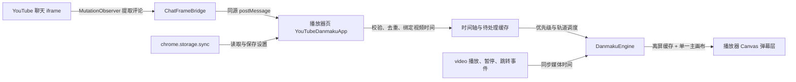

# YouTube 实时弹幕：完整说明

YouTube 实时弹幕是一个面向 Chromium 内核浏览器的 Manifest V3 扩展。它从 YouTube 页面已经加载的直播聊天或聊天回放中提取评论，并以从右向左滚动的弹幕叠加在视频播放器上。

本文档面向希望了解完整功能、实现方式、开发流程和限制的使用者与贡献者。适合 GitHub 首页展示的精简四语介绍见 [README.md](README.md)。

## 项目概览

| 项目 | 当前状态 |
| --- | --- |
| 扩展版本 | `0.1.0` |
| 扩展规范 | Chrome Extensions Manifest V3 |
| 主要技术 | 原生 JavaScript、CSS、Canvas 2D、MutationObserver |
| 目标浏览器 | Chrome、Edge、Brave 等 Chromium 桌面浏览器 |
| 支持页面 | YouTube `/watch` 与 `/live/<video-id>` 视频页 |
| 评论来源 | 页面内的直播聊天或聊天回放 iframe |
| 界面语言 | 简体/繁体中文、日文、韩文、英文；其他语言回退到英文 |
| 数据处理 | 评论在页面内存中处理；项目不提供后端服务 |
| 第三方依赖 | 无；构建与测试仅使用 Node.js 内置模块 |

## 功能清单

### 评论获取与内容保留

- 监听普通文字评论、付费评论和会员通知对应的 YouTube 聊天节点。
- 通过仅监听直接子元素的 `MutationObserver` 捕获新增节点；首次接入聊天列表时补取末尾最多 30 条已有内容。观察器只入列节点，评论解析按每批最多 2 条或约 2 ms 分片执行并批量转发，避免聊天突发时长时间占用主线程。
- 保留文字与图片表情的原始顺序，支持普通表情和会员表情。
- 读取付费评论的页面主题色作为弹幕文字颜色。
- 识别普通观众、房管和频道主；房管与频道主弹幕带昵称身份标签。
- 对聊天节点和播放器端消息分别去重，避免 SPA 更新或 DOM 复用造成重复弹幕。
- 兼容 YouTube 单页应用导航，并按视频 ID 隔离缓存，避免切换视频后混入上一视频的评论。

### 弹幕显示与布局

- 在 YouTube 播放器控制栏右侧加入弹幕设置按钮，并在播放器内显示响应式设置面板。
- 使用单个主 Canvas 绘制所有弹幕，每条内容使用离屏 Canvas 缓存，降低高密度场景中的 DOM、布局与合成开销。
- 根据设备像素比渲染并对齐物理像素；设备像素比最高按 3 倍处理，兼顾清晰度与资源占用。
- 弹幕从播放器右侧进入，在统一存活时间内走完“播放器宽度 + 弹幕自身宽度”；长弹幕会自动使用更高的水平速度。
- 显示区域从播放器顶部开始，可选 25%、50%、75% 或 100%。
- 弹幕层不接收指针事件，不阻挡播放器原有控制操作。
- 播放器或设置变化时通过 `ResizeObserver` 重新计算 Canvas、轨道数、速度和离屏表面。

### 轨道与拥挤控制

- 轨道按字号计算行高，并从上到下寻找可用位置。
- 同时检查当前间距和未来追尾风险，避免后方高速弹幕在前方弹幕离场前发生碰撞。
- 轨道满载时普通评论进入延后队列，获得安全轨道后从画面右侧起跑，避免大面积重叠和临时拥挤造成的直接丢失。
- 房管和频道主弹幕属于受保护消息：引擎会先抢占阻塞轨道中的普通弹幕；仍无安全轨道时，以至少 350 ms 的间隔选择负载较低的轨道强制播放。
- 受保护消息使用独立优先队列；队列中的过期内容会在再次调度前清理。

### 重复评论合并

- 仅对普通观众的、仍处于实际显示周期内的完全相同内容进行合并；文字与表情 URL 都参与判定。
- 第一条和第二条相同评论保持独立滚动。
- 从第三条开始，在播放器顶部可用轨道显示居中的加粗版本，并用绿色描边、白色文字的 `+2`、`+3` 等标记额外重复次数。
- 计数更新带短暂脉冲缩放效果；中置内容仍使用用户选择的字体和不透明度。
- 中置弹幕会锁定对应轨道，但不会删除该轨道中已经存在的滚动弹幕。
- 中置弹幕数量按显示区域固定限制：25% 最多 2 条、50% 最多 3 条、75% 最多 4 条、100% 最多 5 条。显示区域低于 100% 时，每条中置弹幕会尝试在设置范围外补充一条滚动轨道；拓展行数量按播放器剩余空间单独截断且不影响中置弹幕上限，例如 3 条中置弹幕只剩 2 行空间时仅拓展 2 行。中置弹幕结束后，对应拓展行立即停止接收新弹幕，但其中已有弹幕会保持原轨道正常播完；最底部空闲的拓展行随后自动回收。
- 中置弹幕会在轨道空间不足时限制放大字号和增强描边，保留相邻轨道间距。
- 重复显示周期按真实动画时间推进，因此视频倍速不会缩短或延长其屏幕可见时长。

### 播放状态与时间轴同步

- 视频暂停、缓冲或结束时冻结弹幕；恢复播放后从原位置继续。
- 视频倍速影响评论何时按视频时间进入调度，但不改变已经显示的弹幕在屏幕上的滚动速度。
- 拖动进度、快进或快退时，立即按目标视频时间重算弹幕位置。
- `seeked` 后从本视频已缓存的评论重建当前可见时间窗，快退时可恢复仍应可见的弹幕。
- 播放器端最多保留最近 4,000 条评论；重建时最多恢复目标时间之前最近 300 条候选，控制内存和重建开销。
- 引擎暂停、关闭、达到单帧生成上限或轨道暂时满载时会延后普通评论（最多 300 条）并保留受保护评论，恢复可用后继续按优先级调度；延后的实时评论不会按原视频时间提前过期，而是在实际生成时从画面右侧起跑。时间轴重建的历史评论仍按原视频时间恢复位置和清理可见周期，只有超过安全队列上限的实时队列项才会被丢弃。

### 设置与界面

设置实时应用，并通过 `chrome.storage.sync` 保存。若在非扩展测试环境中运行，则回退到 `localStorage`。

| 设置 | 默认值 | 范围/选项 | 实现说明 |
| --- | --- | --- | --- |
| 启用弹幕 | 开启 | 开启/关闭 | 隐藏或显示弹幕层，并控制动画循环 |
| 全屏时隐藏评论栏 | 关闭 | 开启/关闭 | 仅在全屏生效；将评论栏置于播放器后方并收缩占位，但保持 iframe 在视口中运行 |
| 显示区域 | 50% | 25%–100%，步长 25% | 调整弹幕舞台高度，顶部对齐 |
| 不透明度 | 70% | 0%–100%，步长 1% | 同时应用于文字、描边、表情和身份标签 |
| 弹幕字号 | 24 px（界面显示 100%） | 12–40 px，步长 1 px | 影响行高、轨道数、间距和表情尺寸 |
| 弹幕速度 | 1.0× | 0.1×–2.0×，步长 0.1× | 调整统一存活时间，不与视频倍速绑定 |
| 字体 | 浏览器默认无衬线字体 | 默认、Arial、Noto Sans、微软雅黑/苹方 | 不可用字体由系统回退 |
| 粗体 | 关闭 | 开启/关闭 | 普通弹幕使用 700 字重，否则使用 500 |
| 描边粗细 | 2 px | 0–4 px，步长 0.5 px | 使用统一黑色圆角描边 |

设置面板支持点击外部或按 `Esc` 关闭；窗口尺寸和全屏状态变化时会重新定位。界面遵循 `prefers-reduced-motion`，在用户请求减少动态效果时关闭面板与控件过渡动画。

### 多语言

- 扩展名称和描述由 Chrome `_locales` 资源提供：英文、简体中文、繁体中文、日文、韩文。
- 设置面板由 `src/i18n.js` 提供：中文、日文、韩文、英文。
- 优先读取 `chrome.i18n.getUILanguage()`，不可用时读取浏览器 `navigator.language`。
- 简体和繁体中文界面当前共用中文设置文案；未支持的语言回退到英文。

## 实现架构



### 1. 聊天 iframe 桥接

`src/content.js` 以 `all_frames: true` 注入 YouTube 页面。在 `/live_chat` 和 `/live_chat_replay` iframe 中，`ChatFrameBridge` 查找聊天列表并监听普通评论、付费评论和会员通知节点。

提取结果由文字段和表情段组成，并附带评论 ID、视频 ID、作者昵称、身份与页面颜色。消息通过限定为当前 YouTube 源的 `window.top.postMessage` 发送给顶层播放器页。

### 2. 播放器应用与生命周期

顶层页面中的 `YouTubeDanmakuApp` 负责：

- 监听 YouTube 的 `yt-navigate-finish`、`yt-page-data-updated`、浏览器历史导航和 DOM 变化。
- 在播放器可用时挂载控制按钮、设置面板和弹幕舞台。
- 在视频切换或离开支持页面时销毁引擎、事件监听器和旧缓存。
- 校验消息来源、结构、字段长度、角色枚举与内容总量，拒绝顶层页面伪造或旧 iframe 迟到的消息。
- 将评论到达时的 `video.currentTime` 记录为时间戳，然后送入引擎并保留有限时间轴缓存。

顶层应用在挂载竞态期间最多暂存 100 条属于当前视频的消息，挂载完成后再补交。

### 3. Canvas 弹幕引擎

`src/danmaku-engine.js` 同时支持浏览器全局对象和 CommonJS 导出，因此纯调度逻辑可以直接在 Node.js 中测试。

引擎以 `requestAnimationFrame` 推进屏幕运动，以媒体时间负责消息调度和显式跳转同步。滚动存活时间依据播放器宽度缩放，并限制在 4–9 秒的基础范围内，再由用户速度系数调整。弹幕速度按 `(播放器宽度 + 弹幕宽度) / 存活时间` 计算。

文字、表情、身份标签和计数标记先绘制到逐条离屏 Canvas，主 Canvas 每帧只负责合成。表情 URL 只接受 HTTPS，采用异步解码、无 referrer 加载和内存缓存；加载完成后重建相关离屏表面。

### 4. 全屏评论栏处理

启用“全屏时隐藏评论栏”后，扩展不会对聊天 iframe 使用 `display: none`、`visibility: hidden` 或透明度隐藏，因为这些方式可能让评论更新暂停。CSS 同时兼容 YouTube 当前常见的 `ytd-watch-flexy` 与 `ytd-watch-grid` 全屏布局：评论栏保留在视口内并置于播放器后方，原有侧栏占位被收缩，播放器覆盖其上。

### 5. 设置持久化

扩展仅请求 `storage` 权限，并使用 `chrome.storage.sync` 保存完整设置对象。保存操作对滑块输入进行 250 ms 防抖，在选择框、复选框或滑块提交时立即落盘。所有读取值都会按类型、范围和步长重新规范化。

## 目录结构

```text
.
├─ _locales/                 扩展名称与描述的本地化资源
├─ assets/icons/             图标源文件
├─ icons/                    扩展运行时图标
├─ scripts/build.js          零依赖构建脚本
├─ src/
│  ├─ content.js             iframe 桥接、页面生命周期、设置面板
│  ├─ content.css            弹幕层、面板与全屏布局样式
│  ├─ danmaku-engine.js      Canvas 渲染、轨道、队列和时间轴
│  └─ i18n.js                设置面板多语言
├─ tests/
│  ├─ content-session.test.js 页面会话、校验与全屏样式测试
│  ├─ danmaku-engine.test.js  调度、碰撞、渲染与重复合并测试
│  ├─ i18n.test.js            语言选择与回退测试
│  ├─ ui-fixture.html         本地视觉检查页
│  └─ dev-server.js           零依赖静态测试服务器
├─ dist/                     构建生成的可发布扩展
├─ manifest.json             Manifest V3 配置
└─ package.json              项目元数据与 npm 脚本
```

## 安装与使用

### 环境要求

- Node.js：建议使用仍在维护的 LTS 版本。
- Chromium 桌面浏览器：Chrome、Edge、Brave 或其他支持 Manifest V3 的浏览器。
- 无需运行 `npm install`，项目没有第三方 npm 依赖。

### 构建

```bash
npm run build
```

构建脚本会重新创建 `dist/`，写入调整过资源路径的 Manifest，并复制运行时脚本、样式、图标与语言资源。可发布内容位于 `dist/`。

### 加载扩展

1. 打开浏览器的扩展管理页，例如 Chrome 的 `chrome://extensions` 或 Edge 的 `edge://extensions`。
2. 开启“开发者模式”。
3. 选择“加载已解压的扩展程序”。
4. 选择项目构建生成的 `dist/` 目录。
5. 打开带有直播聊天或聊天回放的 YouTube 视频。
6. 点击播放器控制栏右侧的弹幕设置按钮，启用或调整弹幕。

修改 `src/`、`icons/`、`_locales/` 或 `manifest.json` 后，需要重新运行构建并在扩展管理页重新加载扩展。

## 开发与验证

### 自动测试

```bash
npm test
```

该命令依次验证：

- 语言标准化、浏览器语言选择和英文回退。
- URL/视频 ID、设置规范化、消息结构与来源校验、SPA 会话切换和全屏样式。
- 弹幕坐标、速度、碰撞预测、轨道选择、身份优先级、表情安全、Canvas 渲染、重复合并、暂停与跳转同步。

### 本地 UI 检查

```bash
node tests/dev-server.js
```

然后访问 `http://127.0.0.1:4173/tests/ui-fixture.html`，可检查播放器按钮、设置面板、身份标签和弹幕轨道。该页面是视觉夹具，不会连接 YouTube 或获取真实评论。停止服务器可按 `Ctrl+C`。

### 推荐修改流程

1. 修改 `src/` 或本地化资源。
2. 运行 `npm test`。
3. 运行 `npm run build`，确保 `dist/` 与源码同步。
4. 在浏览器扩展管理页重新加载 `dist/` 并手动验证支持页面。

## 权限、隐私与安全

### Manifest 权限

| 权限 | 用途 |
| --- | --- |
| `storage` | 保存并在浏览器账号支持时同步弹幕设置 |
| `https://www.youtube.com/*` | 在 YouTube 视频页及聊天 iframe 中运行内容脚本 |

项目不申请标签页、历史记录、Cookie、下载、通知或后台网络权限。

### 数据处理

- 评论文本、作者显示名、角色、颜色和表情地址仅在当前 YouTube 页面内存中用于渲染。
- 项目不包含分析统计、遥测、广告、账号系统或自有后端，也不会主动上传评论或观看记录。
- 设置保存在 `chrome.storage.sync`；如果浏览器账号开启同步，设置可能由浏览器厂商的同步服务跨设备传输。
- 表情使用 YouTube 页面已提供的 HTTPS 图片地址加载；非 HTTPS 地址会被拒绝。

### 消息边界

播放器页仅接收同源、来自子窗口、带有扩展标记且通过结构/长度校验的消息。切换视频时，消息还必须匹配当前视频 ID，以降低旧 iframe 延迟消息和页面脚本伪造数据造成的干扰。

## 已知限制

- 只有页面提供直播聊天或聊天回放 iframe 时才有弹幕来源；没有聊天回放的普通录播无法生成弹幕。
- 评论来源是页面当前已加载的 DOM，不会通过 YouTube API 补拉完整历史记录。
- YouTube 会持续调整内部 DOM、CSS 变量和全屏布局，未来改版可能需要更新选择器或样式。
- 频道主/房管识别优先使用节点属性，并对常见中英文徽章文本进行兜底；其他本地化文本或新节点结构可能识别失败。
- 字体是否可用取决于操作系统和浏览器；未安装时会回退到可用的无衬线字体。
- 当前没有浏览器商店安装包或自动发布流程，需要以开发者模式加载 `dist/`。
- 当前没有评论翻译功能，也不需要或读取翻译 API Key。

## 计划中的方向

`Todo.md` 记录了“高级设置中支持 API 翻译或免费翻译路径”的设想。该功能尚未实现；若未来开发，需要先明确服务选择、密钥存储、隐私提示、速率限制与失败回退方案。

## 常见问题

### 播放器上没有出现设置按钮

确认当前页面是 `/watch` 或 `/live/<video-id>`、播放器已经加载完成，并在扩展管理页检查扩展是否已启用。修改代码后还需重新构建并重新加载 `dist/`。

### 有设置按钮但没有弹幕

确认视频具有可见的直播聊天或聊天回放、设置中的“启用弹幕”已开启，并检查 YouTube 是否更改了聊天节点结构。

### 全屏隐藏评论栏后仍看不到弹幕

隐藏评论栏与启用弹幕是两个独立设置。检查弹幕开关、显示区域、不透明度，以及当前视频是否仍在产生聊天消息。

### 设置没有跨设备同步

同步能力取决于浏览器是否登录账号、是否开启扩展设置同步，以及浏览器对 `chrome.storage.sync` 的实现。扩展无法强制开启浏览器同步。

## 贡献与问题反馈

欢迎通过 GitHub Issue 提交可复现的问题或功能建议。报告 YouTube 页面兼容问题时，建议提供浏览器版本、视频页面类型、是否全屏、是否为聊天回放，以及控制台错误；请勿提交 Cookie、会话、账号信息或其他隐私数据。

提交代码前请运行测试和构建，并确保只包含与改动直接相关的文件。

## 致谢与许可说明

弹幕运动模型和默认参数参考了 Bilibili 风格的滚动体验。项目开发期间还参考了本地的 `youtube_danmuku_v2.js`，其原项目声明为 MIT License；当前扩展的 Canvas 引擎、轨道调度、重复合并、页面生命周期和全屏布局为本项目实现。

当前仓库尚未包含独立的 `LICENSE` 文件。在明确添加许可证之前，请不要假定本仓库代码已获得某种开源许可证；发布或再分发前请先向项目维护者确认。
